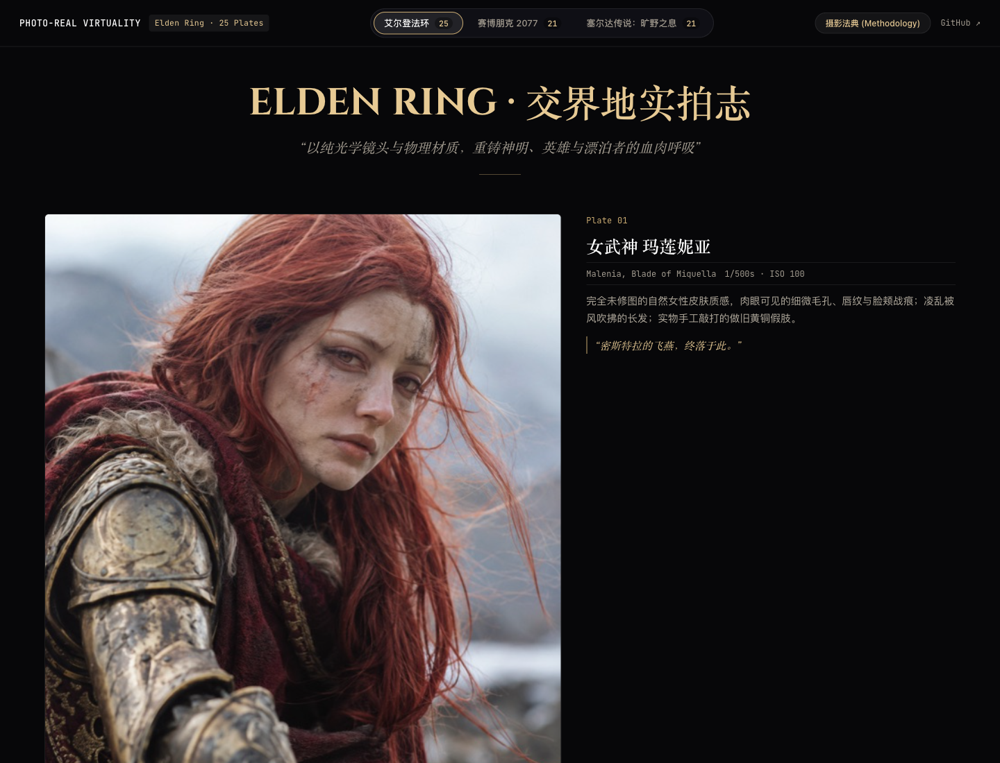

# PHOTO-REAL VIRTUALITY · 游戏写实影像

将艾尔登法环、赛博朋克2077与塞尔达角色和场景转译为摄影风格AI图像。

A photography-style AI image gallery reimagining Elden Ring, Cyberpunk 2077 and Zelda.

[在线体验](https://elden-ring-liveaction.xiaosang.cc/) · [源码](https://github.com/holynova/elden-ring-liveaction)



## 可以做什么

- 切换游戏世界，在画册与灯箱中浏览图像。
- 查看镜头风格、提示词与原图对照。

## 三个游戏世界

艾尔登法环25幅、赛博朋克2077共21幅、塞尔达共21幅。使用顶部选择器或G键切换游戏，点击图像打开详情，方向键翻页，Esc关闭。

这些是AI生成的摄影风格图像，镜头与相机参数用于风格描述，不是实际拍摄记录；属于非官方二次创作。生成资料见 `games_data.py`，缩略图维护见 `generate_thumbnails.py`。

## 本地运行

```bash
python3 -m http.server 8080
```

打开 http://localhost:8080/。使用本地HTTP服务即可，无需安装前端框架。


## 发布

```bash
npx --yes wrangler@4.128.0 deploy --dry-run --config wrangler.jsonc
npx --yes wrangler@4.128.0 deploy --config wrangler.jsonc
```

从 `main` 同一提交在本地手动发布到Cloudflare Workers。正式地址：[https://elden-ring-liveaction.xiaosang.cc/](https://elden-ring-liveaction.xiaosang.cc/)。 `.assetsignore` 限定公开播放器/站点资源，排除合成工程、开发文件与未供页面使用的大体积音频/字体。
